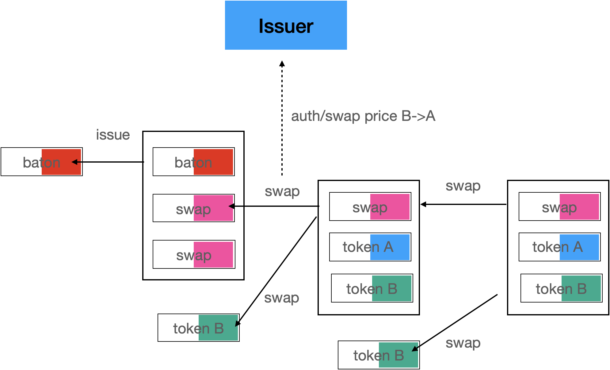

# CUTP - Controllable UTXO Token Protocol

> 征求意见稿，版权所有，无作者授权，不得公开，复制，实现，测试

## 概要 Summary

CUTP是一个可控的层一UTXO Token协议。整体概念图如下所示。


每个不同的颜色输出是不同的合约。每个交易的输入和输出都有一个指向创世合约的contractId，最终形成一条交易链。


协议使用比特币脚本实现全部的功能。由比特币矿工体系和发行者以及其他见证人共同维持Token系统的安全。


协议同时支持Token，NFT以及销售和交换等功能。


协议支持合约升级。


协议支持使用SPV验证，以及P2P的转账。


## 创世合约 Genesis Contract


创世合约保存了Token的基本信息。其锁定函数是一个P2PKH类型的函数，需要发行者的签名才可解锁。创世合约一旦被创建，立即被花费，构造一个Baton合约输出。


创世合约的数据区为


```plain
 OP_RETURN prefix(前缀CONTRACT_BRFC_ID 6字节) name(名称 utf8字符串) symbol(标示 utf8字符串) issuer(发行商 utf8字符串) domain(发行者域名 utf8字符串) rule(规则 数字) decimals(小数位数 数字)
```

1. prefix(CONTRACT_BRFC_ID 6 bytes) 
2. name(utf8 string) 
3. symbol(utf8 string)
4. issuer(utf8 string) 
5. domain(utf8 string) 
6. rule(int) 
7. decimals(int)


数据区格式遵循比特币脚本标准。

## 

## Baton合约 Baton Contract


Baton合约只有一个，每次花费都应该创建一个新的。需要发行者私钥签名才能解锁。

输出由发行者决定，但要严格保障contractId没有被修改。

随后的数据区附加

```plain
 OP_RETURN prefix(前缀BATON_BRFC_ID 6字节) contractId(合约ID 32字节)  
```

1. prefix(BATON_BRFC_ID 6字节)
2. contractId(ID 32字节)

数据区格式遵循比特币脚本标准。

一个构造好的Baton增发交易类似


花费Baton UTXO时，输出需要包括一个且只包括一个Baton UTXO输出。其中的发行者地址可以修改。

还可以输出多个Token合约，Sale合约，Swap合约。

甚至可以销毁，不输出新的Baton。一旦销毁Baton，Token将变得不可控。

Baton合约由发行者控制，拥有最大权限。增发调用见证人API，获取许可。

## Token合约 Token Contract


Token合约由Baton或者Sale，Swap合约创建，Token的拥有者可以进行转账和销毁。

在构造时需提供 prefix(前缀TOKEN_BRFC_ID 6字节) contractId(合约Id 32bytes) 和见证人Rabin公钥。

Token合约的数据区为

```plain
 OP_RETURN authCount(认证计数 1byte) ownerPkh(持有者公钥哈希 20bytes) tokenAmount(数量 32bytes)
```

数据区格式为字节数组的链接形式。

### 转账


转账有多种情况

* 完整转账：一个Token输入，一个Token输出
* 分割转账：一个输入，两个输出
* 合并转账：多个输入，一个输出
* 合并找零转账：多个输入，两个输出

因此，输入可以是多个，输出最多两个


一个标准转账交易如图


如果token是由其他合约进行的转账，输出可能是


解锁函数需要考虑Token之前还有其他输出的情况 


调用发行者服务器的API，获取许可。


构造所有的Token输入outpoint，和输出的金额（一个或者两个）。

见证人API将返回每一个欲花费UTXO的许可。许可使用Rabin算法签名。在花费时检查签名。如果API返回不许可，将可能无法转账。


### 无许可转账 Unauthorized transfer

如果许可API不可用，或者处于无法连接网络的情况。可以无许可转账。认证计数加一。等之后连上网络，再次进行花费时，见证人API将根据认证计数，进行回溯检查。


### 销毁 Burn

Token的持有者调用销毁解锁函数可以销毁。


## 发行者和见证人（Issuer and Withness）


发行者和见证人提供一组基于BSVAlias格式的API，对公钥获取，转账，销售和交换进行认证和价格支持，并且可以根据合约hash值获取合约代码。


创建合约时，发行者外加另外3个见证人，一共4个认证中至少获取2个认证，才可以执行合约。


所有的认证签名使用Rabin签名算法。发行者可以同见证人协商共同禁止某个Token甚至某个地址的转账。

见证人服务商可以公开自己的公钥以及域名。钱包维持一份见证人列表，通过公钥查询见证人的域名，进而访问BSVAlias协议的API获取对UTXO的认证。见证人服务商可以从Token发行者处收取费用。形成见证人供销服务市场。


支持销售和交换合约的发行者需要提供报价服务。如果没有能力，可以付费给某个见证人购买服务。


## 销售合约 Sale Contract


销售合约由Baton输出。可以让Token的购买者附加足够的Satoshi，换取Token。


Token合约不是销售合约的一部分。销售合约持有Token合约哈希值。在输出时将检查是否正确输出。由Baton合约可以同时生成多个销售UTXO，因此支持并发的销售。


一个构造好的销售如下所示


不支持无许可销售。

销售合约需要发行者返回输出的token数量和销售金额，并以下面的格式对价格进行签名。

```plain
 contractId(合约ID 32字节) buyerPKH(购买者的PKH 20字节) tokenAmount(输出的token数量 32字节)  sellerPKH(销售者的PKH 20字节) satoshiAmount(销售金额, 8字节)  
```

发行人在提供可用的Sale UTXO时控制最大可销售的Token数量，最小购买金额，最大购买金额，以及销售期间。

无论什么人都可以调用此UTXO完成购买。

销售结束后，发行人可以销毁Sale UTXO。

## 交换合约(Swap)


交换合约由Baton输出。可以让Token A的购买者附加提供某种Token B，换取Token A。两种Token合约都不是交换合约的一部分，但是交换合约持有它们的合约脚本哈希值。在输出时将检查是否正确输出。由Baton合约可以同时生成多个交换UTXO，因此支持并发的交换。




一个构造好的交换如下所示


不支持无许可交换。

发行人在提供可用的Sale UTXO时控制最大可销售的Token数量，最小购买金额，最大购买金额，以及销售期间。


## NFT合约 NFT Contract

NFT合约是Token的一个变形。他只支持1对1的转账，可以由发行者发行，或者由售卖合约或者交换合约发行。NFT可以要求必须获取认证。


NFT数据区包括

```plain
 OP_RETURN data(数据) dateLen(数据长度 4字节) expire(过期时间 4bytes) authCount(无许可转账次数 1字节) 持有人公钥哈希(ownerPkh 20字节)
```

NFT合约包含一个expire字段。如需其他数据结构，可以放在数据区。

数据区由创造者填充，保存在合约中。也可以按照发行算法自动生成，或者是某个数据交易的outpoint，也可以是保存在链下的数据证明。


## 伪造攻击 Forgery attack


### 伪造创世合约 Forge Genesis

伪造创世合约，改变合约ID，在钱包中将认为是两个不同的Token，并且发行商无法识别，Token无法转账

### 伪造Baton合约 Forge Baton

伪造的Baton，如果不修改发行商地址，因为不持有私钥，无法构造签名。将无法发行Token。

### 伪造Token合约 Forge Token

伪造的Token，在转账时无法获得认可。无许可P2P转账后，一旦联入网络，新UTXO将无法转账。因此，无许可P2P转账是不安全的。


### 

### 伪造Token输出的数量 Forge Token

攻击者使用正常的Token UTXO作为输入，但在输出时修改数量，进行恶意增发。收到新UTXO输出的钱包和见证人将进行校验，发现造假则无法花费。而且导致造假者的原Token损失。

### 伪造销售和交换合约 Forge Sale/Swap

伪造的销售和交换合约，无法获得认证。

### 伪造发行商和见证人服务器 Forge Issuer/Witness

伪造者同时修改见证人公钥和见证人服务器，欺骗Token接收者。钱包收到Token以后应该自行校验，并且调用第三方见证人API进行校验。

## 校验交易 Check transaction

钱包和见证人收到Token之后或者在发送Token交易之前需要校验。如果不进行校验，Token将只可以转账指定的次数（缺省可以设为25），最大255次。钱包应单独校验交易，防止见证人作恶。

### 校验逻辑 Check logic

1. 检查Token UTXO交易的输入，应该有一样的Token类型，或者有Sale或者Swap合约。

2. 类型检查：是否有一样的合约ID 

3. 数量检查：同类型的Token转账，在输入和输出中的数量合计应该一样   

### 钱包校验 Wallet Check

钱包收到Token后，**必须**进行校验。

如果authCount=0，只需要校验交易的输入是否可以合法构造Token UTXO。

如果authCount大于0，需要回溯校验相应次数的交易


### 见证人校验 Withness Check

Withness见证人收到认证请求后，查看对应的outpoint所在的UTXO。

如果authCount=0，只需要校验交易的输入是否可以合法构造Token UTXO。

如果authCount大于0，需要回溯校验相应次数的交易。

校验成功或失败，返回认证结果。

## 合约升级 Contract upgrade

合约可以通过Baton合约的Issue方法做出改变。代码区不同的Token无法一起转账。

## BRFC

每个合约使用不同的BRFC ID作为区别。钱包和见证人通过BRFC对合约的种类做出区分。

## 版权 License

**Copyright (c) 2020 LI Long, ChainBow Co. Ltd.**

**All rights reserved.**
