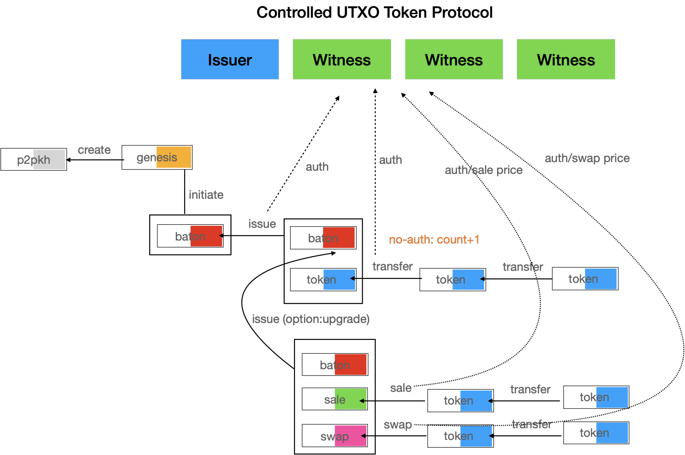
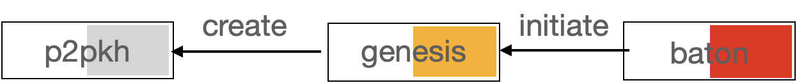
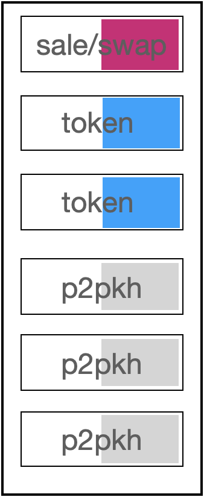
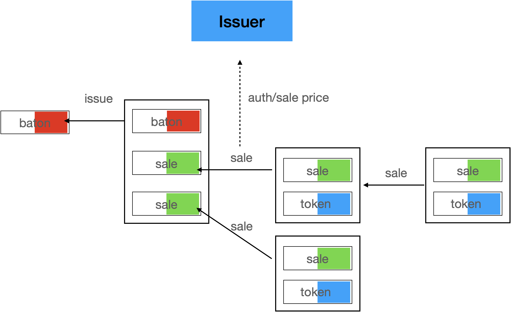
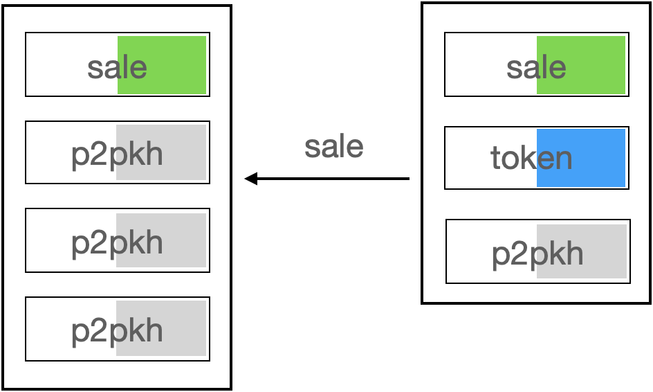
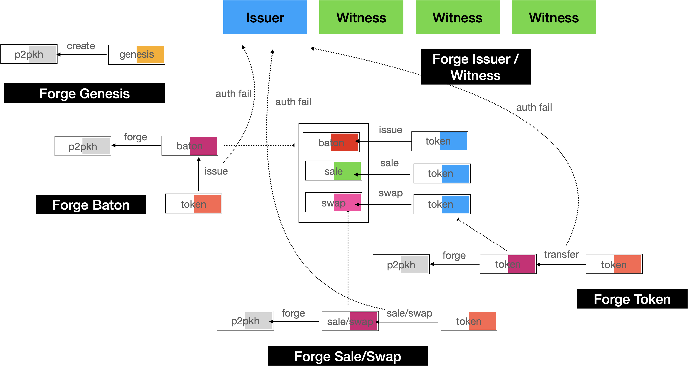

# CUP - Controllable UTXO Token Protocol

> Draft for comments, all rights reserved, not authorized by the author, may not be published, copied, implemented, tested

## Summary

CUP is a controllable layer 1 UTXO Token protocol. The overall concept is shown below.



Each different color output is a different contract. The input and output of each transaction has a contractId that points to the genesis contract, ultimately forming a transaction chain.

The protocol uses a bitcoin script to do all the work. The security of the Token system is maintained by the bitcoin miner system together with the issuer and other witnesses.

The protocol supports Token, NFT, and Sale and Swap functions.

The protocol supports the contract upgrade.

The protocol supports the use of SPV and P2P transfer.

## Genesis Contract


The Genesis contract holds the basic information about Token. The lock function is a P2PKH type that requires the publisher’s signature to unlock. Once the Genesis contract is created, it is immediately spent to construct a Baton contract output.



The data area for the Genesis contract is

```plain
 OP_RETURN name(utf8 string) symbol(utf8 string) issuer(utf8 string) domain(utf8 string) rule(int) decimals(int) suffix(CONTRACT_BRFC_ID 6bytes) 
```

The data area format follows the bitcoin script standard.

## 

## Baton Contract


There is only one baton contract UTXO, and a new one should be created for each spent. Requires the publisher’s private key signature to unlock.

The output is determined by the publisher, but make sure contractId isn’t modified

Data area append

```plain
 OP_RETURN contractId(32bytes) suffix(BATON_BRFC_ID 6bytes)
```

The data area format follows the bitcoin script standard.

A Baton Issue transaction is similar


When you spend Baton UTXO, the output needs to include one and only one Baton UTXO output. Where the publisher address can be modified.


You can also output multiple Token contracts, Sale contracts, and Swap contracts.

It can even be destroyed Baton UTXO without output.Once the Baton is destroyed, Token becomes uncontrollable.

The Baton contract is controlled by the issuer and has maximum permissions. Add calls to the witness API to get permission.

## Token Contract


Token contracts are created by Baton or Sale, Swap contracts, and Token owners can transfer and destroy them.

The prefix (prefix TOKEN 6 bytes) contractId (contract ID 32bytes) and the witness Rabin public key are required for construction.

The data area for the Token contract is

```plain
 OP_RETURN tokenAmount(32bytes) authCount(1byte) ownerPkh( 20bytes) suffix(TOKEN_BRFC_ID 6bytes)
```

The data area is concated with bytes.

### Transfer


There’s a variety of transactions

* Full transfer: one Token input, one Token output
* Split: one input, two outputs
* Merge: multiple Inputs, one output
* Merge having change: multiple inputs, two outputs

Thus, the input can be multiple and the output can be up to two

 A standard token transfer transaction is shown in figure


If token is a transfer from another contract, the output might be



The unlock function needs to take into account the fact that Token has other outputs before it。

Call the publisher Server’s API to get permission

Construct all tokens input to outpoint, and the amount of output (one or two) .

The witness API returns every auth result that wants to spend UTXO. The auth signed using the Rabin Algorithm. Check signature at time of spend. If the API returns not approved, the token be unable to transfer.

### Unauthorized transfer

If the witness API is not available, or if you are in a situation where you can not connect to the internet. You can transfer token without permission. Authentication count plus one. When the time comes to connect to the network and spend again, the witness API will back check based on the authentication count.

### Burn

The holder of Token can be destroyed by calling the burn unlock function

## Issuer and Witness


The issuer and witness provides a set of BSVAlias APIs to authenticate and provide price support for public key acquisition, transfer, sale and swap, and to obtain contract codes based on contract hash values.

When the contract is created, the issuer plus three additional witnesses, obtaining at least two out of a total of four certifications before the contract can be executed.

All authenticated signatures use the Rabin signature algorithm. The issuer may negotiate with the witness to jointly prohibit the transfer of a Token or even an address.

The witness service provider may disclose its own public key as well as the domain name. The Wallet maintains a list of witnesses, queries the domain name of the witness with a public key, and then accesses the BSVAlias protocol API to obtain authentication for UTXO. The witness service provider can charge the Token publisher a fee. To form the market of witness supply and marketing service.

Issuer that support Sale and Swap contracts need to provide a quote service. If you do not have the ability, you can pay for the services of a witness.

## Sale Contract


The sales contract is outputed by Baton. You can have Token buyers attach enough Satoshi Tokens in exchange for tokens

Token contract is not part of a sales contract. The sales contract holds the Token contract hash value. The correct output is checked at output time. Multiple Sale UTXOs can be generated simultaneously by the Baton contract, thus supporting concurrent sales




A sale transaction is shown below



No support for without auth sales.

The sales contract requires the publisher to return the number of Tokens outputted and the sales amount, and to sign the price in the following format.

```plain
 prevOutpoint(UTXO outpoint 36bytes) contractId(32bytes) buyerPKH(20bytes) tokenAmount(32bytes)  sellerPKH(20bytes) satoshiAmount( 8bytes)  
```

The publisher controls the maximum number of tokens available for Sale UTXO, the minimum purchase amount, the maximum purchase amount, and the period of Sale.


Anyone can call this UTXO to complete the purchase.

When the Sale is over, the issuer can destroy the Sale UTXO.

## Swap Contract


The swap contract is outputed by Baton. The purchaser of Token A can be asked to provide some Token B in exchange for Token A. Neither Token contract is part of the exchange contract, but the exchange contract holds their contract script hash value. The correct output is checked at output time. Multiple swap UTXO can be generated simultaneously by the Baton contract, thus supporting concurrent swaps.


A structured swap transaction is shown below


No auth swap is not supported.

The issuer controls the maximum number of tokens available for Sale UTXO, the minimum purchase amount, the maximum purchase amount, and the period of Sale.

## NFT Contract

The NFT contract is a variation of Token. It only supports one-to-one transfers, which can be issued by the issuer, or by a sales or exchange contract. NFT can require that authentication must be obtained.


The NFT data area includes

```plain
 OP_RETURN data(n bytes) dateLen(4bytes) expire(4bytes) authCount(1byte) ownerPkh(20bytes)
```

The NFT contract contains an expire field. If you need another data structure, you can put it in the data area

The data area is populated by the Creator and saved in the contract. It can be generated automatically according to the distribution algorithm, or it can be an outpoint of a data transaction, or it can be a proof of data stored in the chain.

## Forgery attack



### Forge Genesis

Forging the Genesis contract, changing the contract ID, will be considered as two different tokens in the wallet, and the Issuer can not identify, Token can not transfer

### Forge Baton

Forged Baton, if the publisher address is not modified, can not construct the signature because it does not hold a private key. Token will not be published.


### Forge Token

Forged Tokens are not accepted at the time of the transfer. When P2P transfers are made without auth, the new UTXO can not be transferred once it is connected to the network. Therefore, P2P transfers without auth are not safe

### 

### Forge Token

The attacker uses a normal Token UTXO as input, but modifies the number at output for malicious re-distribution. Wallets and witnesses that receive the new UTXO output will be verified and found to be counterfeit and can not be spent. And cause the original Token of the counterfeiter to be lost.


### Forge Sale/Swap

Forged sales and exchange contracts can’t be certified.

### Forge Issuer/Witness

Counterfeiters modify both the witness public key and the witness server to deceive Token recipients. The wallet should verify itself after receiving the Token and call the third-party witness API to do so.


## Check transaction

The Wallet and witness need to verify the Token after it is received or before sending the Token to the dealer. If not verified, Token will only be allowed to transfer the specified number of times (default can be set to 25) , up to a maximum of 255 times. The wallet should verify the transaction separately to prevent the witness from doing evil.


### Check logic

1. Check the input for Token UTXO transactions, which should have the same Token type, or have a Sale or Swap contract.

2. Type checking: whether the contract ID is the same

3. Quantity check: Tokens of the same type should be transferred in equal amounts in input and output

### Wallet Check

After the Wallet Receives The Token, the token must be checked

If authcount = 0, simply verify that the transaction’s input can be legally constructed as Token UTXO.

If the authCount is greater than 0, the transaction number needs to be back checked

### Witness Check

After the Witness witness receives the authentication request, look up the corresponding UTXO at the outpoint position

If authCount = 0, simply verify that the transaction’s input can be legally constructed as Token UTXO

If the authCount is greater than 0, the transaction number needs to be back checked

Verify success or failure, return authentication result

## Contract upgrade

Contracts can be changed in the Issue method of the Baton contract. Tokens with different code parts can not be transferred together.

## BRFC

Each contract is distinguished by a different BRFC ID. The Wallet and the witness use the BRFC to differentiate between the types of contracts.

## License

**Copyright (c) 2020-2021 LI Long, ChainBow Co. Ltd.**

**All rights reserved.**
